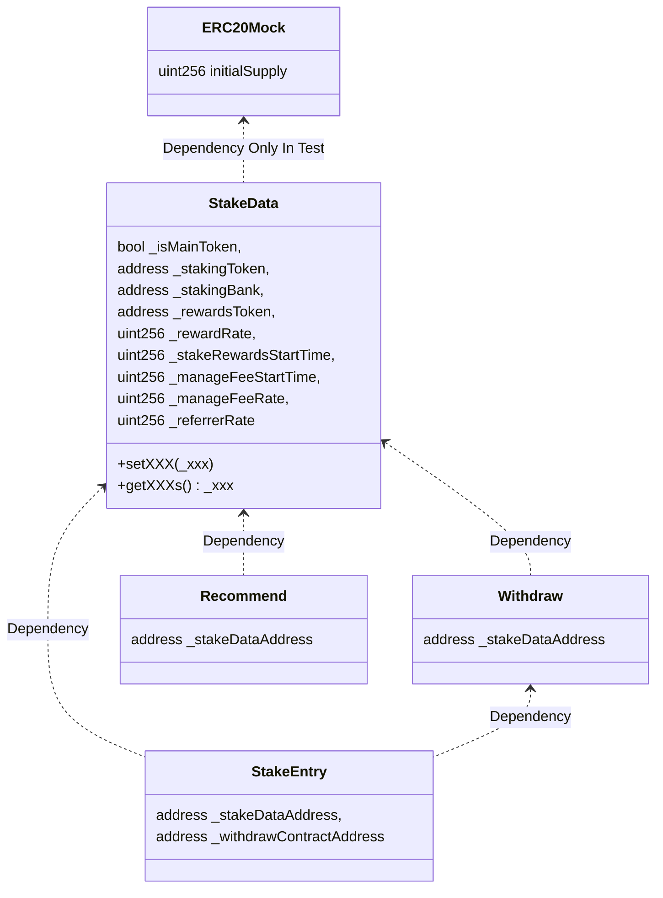

# Staking Vault Solidity

质押代币合约。

具体功能: 

> 当产生提前赎回行为: 
>
> N代表 = 第一笔金额及质押的时间
>
> N+1代表 = 第二笔金额及质押的时间
>
> N+2代表 = 第三笔金额及质押的时间

1. 质押链和币种
   - BSC: BNB、Busd
   - TRON: tRX、usdt
2. 质押时间: 30天
3. 30天利率: 60%
4. 质押逻辑: 需记录每次的质押金额及质押时间(时间戳方式)
   - 【提前赎回的行为】=【总质押金额】—【赎回金额】
   - 【赎回金额扣除】= 优先扣除最早一笔的（即N）；若赎回金额大于N，则从N+1扣除，以此类推）（注: 如果赎回金额>总投入金额，则赎回失败）
   - 【剩余金额的计算逻辑】=N\*质押时间(每30天更新一次收益)\*利率 + N+1\*质押时间\*利率......（以此类推）
     - eg: A用户2.9日14点质押某币种100刀；在2.10日12点质押相同币种200刀；累计共300刀，那么如果A用户在2月14日提取了80刀（则按业务逻辑是只返回本金，没有利润），则剩下220刀，这220刀将分开按“质押时间和利率进行计算”（即为: 2.9日剩下的20刀计算+2.10日剩下的200刀计算=最后到期时间的利润及本金） 
5. 考虑裂变的问题: 所以我们有【邀请业务】A用户邀请B用户。奖励机制: 【A用户收取B用户所有质押总额2.5%】10.1 质押XXX时间（待定）后合约收取5%管理费（24h后给邀请者打2.5%邀奖励），若时间不足收取管理费，没有2.5%的邀请奖励

## 合约说明

### 合约架构



### 合约简介
1. ERC20Mock: ERC20测试使用 
2. StakeData: 质押数据存储合约 
3. Withdraw: 提取入口，资金汇集合约，Owner应及时提取其中的资金 
4. StakeEntry: 质押入口，质押的钱会被转移到Withdraw合约，用于被Owner提取 
5. Recommend: 邀请机制合约

## 合约事件

- 提取质押代币
  - 事件名: WithdrawStake
  - 参数: `_from`、`_amount`
- Owner提取代币
  - 事件名: WithdrawOwner
  - 参数: `_from`、`_amount`
- 质押奖励提取
  - 事件名: RewardStakeClaimed
  - 参数: `_from`、`_amount`
- 邀请奖励提取
  - 事件名: RewardReferrerClaimed
  - 参数: `_from`、`_amount`

## 合约函数

### StakeData: 质押数据

- 设置是否为主代币质押
  - 函数名: setIsMainToken
  - 参数: 无
- 获取是否为主代币质押
  - 函数名: getIsMainToken
  - 参数: 无
- 设置质押银行(提取的时候从此地址提取)
  - 函数名: setStakingBank
  - 参数: _stakingBank
- 获取质押银行
  - 函数名: getStakingBank
  - 参数: 无
- 设置奖励的ERC20 Token地址
  - 函数名: setRewardsToken
  - 参数: _rewardsToken
- 获取奖励的ERC20 Token地址
  - 函数名: getRewardsToken
  - 参数: 无
- 设置质押的ERC20 Token地址
  - 函数名；setStakingToken
  - 参数: _stakingToken
- 获取质押ERC20 Token地址
  - 函数名: getStakingToken
  - 参数: 无
- 设置奖励系数(精度为8，例如5000000代表0.05，下同)
  - 函数名: setRewardRate
  - 参数: `_rewardRate`
- 获取奖励系数
  - 函数名: getRewardRate
  - 参数: 无
- 设置管理费系数
  - 函数名: setManageFeeRate
  - 参数: `_manageFeeRate`
- 获取管理费系数
  - 函数名: getManageFeeRate
  - 参数: 无
- 设置推荐奖励系数
  - 函数名: setReferrerRate
  - 参数: `_referrerRate`
- 获取推荐奖励系数
  - 函数名: getReferrerRate
  - 参数: 无
- 设置质押总量
  - 函数名: setTotalStaked
  - 参数: `_totalStaked`
- 获取质押总量
  - 函数名: getTotalStaked
  - 参数: 无
- 设置质押收益周期(单位: s，下同)
  - 函数名: setStakeRewardsStartTime
  - 参数: `_stakeRewardsStartTime`
- 获取质押收益周期
  - 函数名: getStakeRewardsStartTime
  - 参数: 无
- 设置管理费开始计算时间
  - 函数名: setManageFeeStartTime
  - 参数: `_manageFeeStartTime`
- 获取管理费开始计算时间
  - 函数名: getManageFeeStartTime
  - 参数: 无
- 获取地址质押记录
  - 函数名: getAddressStakeRecord
  - 参数: `_account`、`_stakeRecordId`
- 设置地址质押记录
  - 函数名；setAddressStakeRecord
  - 参数: `_account`、`_stakeRecordId`、`_stakeRecord`
- 获取质押奖励记录
  - 函数名: getStakeRecordRewardsRecord
  - 参数: `_account`、` _stakeRecordId`、`_rewardsRecordId`
- 设置质押奖励记录
  - 函数名: setStakeRecordRewardsRecord
  - 参数: `_account`、`_stakeRecordId`、`_rewardsRecordId`、`_rewardsRecord`
- 获取用户信息
  - 函数名: getAddressUserInfo
  - 参数: _account
- 设置用户信息
  - 函数名: setAddressUserInfo
  - 参数: `_account`、`_userInfo`
- 获取质押的其中一个用户的地址
  - 函数名: getUserStateRecordKeys
  - 参数: _index
- 获取质押的所有用户数量
  - 函数名: getUserStateRecordKeysSize
  - 参数: 无
- 添加质押的用户地址
  - 函数名: pushUserStateRecordKeys
  - 参数: _account
- 获取用户推荐人信息
  - 函数名；getUserReferrer
  - 参数: _user
- 设置用户推荐人信息
  - 函数名: setUserReferrer
  - 参数: `_user`、`_referrer`
- 获取推荐人推荐的用户地址
  - 函数名: getReferrerUsers
  - 参数: _referrer
- 添加推荐人推荐的用户地址
  - 函数名: pushReferrerUsers
  - 参数: `_referrer`、`_users`
- 合约调用者控制
  - 允许调用合约Get函数: addCallGetContract
  - 允许调用合约Set函数: addCallSetContract
  - 取消允许调用合约Get函数: deleteCallGetContract
  - 取消调用合约Set函数: deleteCallSetContract


### StakeEntry: 质押相关

- 【重点测试】质押主代币
  - 函数名: mainTokenStake
  - 参数: 注意value不能为0

- 【重点测试】质押代币
  - 函数名: tokenStake
  - 参数: _amount

- 设置质押时间
  - 函数名: setStakingTime
  - 参数: _stakingTime

- 设置质押收益率
  - 函数名: setRewardRate
  - 参数: _rewardRate

- 设置质押银行，用于提取收益
  - 函数名: setStakingBank
  - 参数: _stakingBank

- 【重点测试】获取合约的质押总额
  - 函数名: totalStaked
  - 参数: 空

- 获取一段时间内的总质押人数(不按天拆分)
  - 函数名: getStakeNum
  - 参数: startTime、endTime

- 获取一段时间内的总质押金额(不按天拆分)
  - 函数名: getStakeAmount
  - 参数: startTime、endTime

- 【重点测试】获取指定人的质押总额
  - 函数名: getStakeAmount
  - 参数: _account


### Withdraw: 提取相关

- 【重点测试】提取本金
  - 函数名: withdrawStake
  - 参数: _amount
- 提取质押收益
  - 函数名: claimStakeReward
  - 参数: _amount
- 提取推荐收益
  - 函数名: claimReferrerReward
  - 参数: _amount
- 【重点测试】提取所有本金+收益
  - 函数名: claimAllReward
  - 参数: _account
- 提取代币给Owner
  - 函数名: withdrawOwner
  - 参数: _amount
- 【重点测试】计算收益相关数值(定时调用)
  - 函数名: calculateReward
  - 参数: 无
- 【重点测试】更新管理费用(定时调用)
  - 函数名: calculateManageFee
  - 参数: 无
- 将所有邀请奖励费用转给对应推荐人(定时调用)
  - 函数名: sendAllReferrerRewards
  - 参数: 无
- 获取指定人的收益历史总额
  - 函数名: getRewardCount
  - 参数: _account
- 获取指定人的收益余额
  - 函数名: getRewardsBalance
  - 参数: _account
- 获取指定人邀请收益历史总额
  - 函数名: getReferrerRewardCount
  - 参数: _account
- 获取指定人邀请收益余额
  - 函数名: getReferrerRewardsBalance
  - 参数: _account

### Recommend: 推荐相关

- 保存邀请人
  - 函数: setReferrer
  - 参数: _referrer
- 查看邀请人
  - 函数: getReferrer
  - 参数: 无


## 安装环境
  ```shell
  npm install
  ```

## 测试&部署合约

### 设置环境变量
1. 从.env.example复制到.env，并修改其中变量
2. ETHERSCAN_API_KEY=ABC123ABC123ABC123ABC123ABC123ABC1
   PRIVATE_KEY=0xabc123abc123abc123abc123abc123abc123abc123abc123abc123abc123abc1
   把KEY换成自己的私钥，ETHERSCAN_API_KEY可以不设置（如果不需要在浏览器能看到合约代码和在浏览器验证合约）

### 测试脚本

1. 编译合约
    ```shell
    npm run compile
    ```
2. 测试覆盖率
    ```shell
    npm run codecov
    ```
3. 测试主代币
    ```shell
    npm run test-maintoken
    ```
4. 测试Token
    ```shell
    npm run test-token
    ```


### 部署脚本

1. 在BSC测试网部署
    ```shell
    # 部署主代币
    npm run deploy-bsctest-maintoken
    # 部署Token代币
    npm run deploy-bsctest-token
    ```

2. 在BSC主网部署
    ```shell
    # 部署主代币
    npm run deploy-bsc-maintoken
    # 部署Token代币
    npm run deploy-bsc-token
    ```

## 网络信息

### BSC测试网
- 水龙头: https://testnet.bnbchain.org/faucet-smart
- 浏览器: https://testnet.bscscan.com/

### Tron测试网(Shasta)
Shasta测试网各个参数与主网保持一致，目前Shasta测试网不支持运行一个节点加入其中。

- 官网: https://www.trongrid.io/shasta
- 水龙头: https://www.trongrid.io/faucet
- 浏览器: https://shasta.tronscan.org
- HTTP API: https://api.shasta.trongrid.io

## 合约地址

### Token质押

1. BSC测试网: 
     - 主代币质押: 
       - StakeData: 0x43D98019dA9c36Cd5eEa7D3910F5f76B15b2Cc27
       - Withdraw: 0xD93Bf4fF0c3B6EF45E2Bfa1D0B146C9b3285CAdE
       - StakeEntry: 0x5CBC5AEcD2Cb1Ceab6a81754A5A6570d3bf2c813
       - Recommend: 0xbB720d733634d22EBf19dC52E97dA71Ef83bD1E4
     - Token质押: 
       - ERC20: 0x72042D9AD9a32a889f0130A1476393eC0234b1b4
         - StakeData: 0xCF3244CEb4a3D707383c53E0dccAC7274b1404D4
         - Withdraw: 0xA2790dCe606817C095e0A8131a4d04e4Fc16ED72
         - StakeEntry: 0x7258e672930b37f8dAE23992B1a9D3e7916C32Ff
         - Recommend: 0xA811444E7238640Ff6af3C0dCd515c2b387ebdCA
2. BSC主网: 
